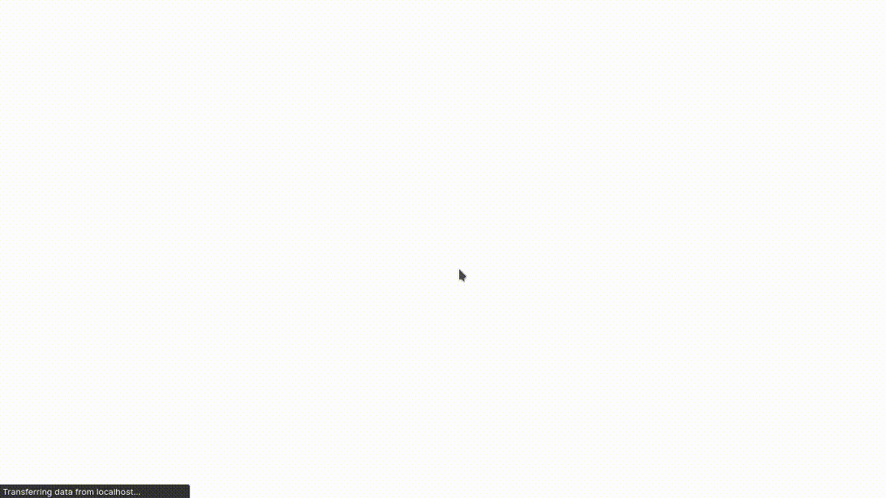
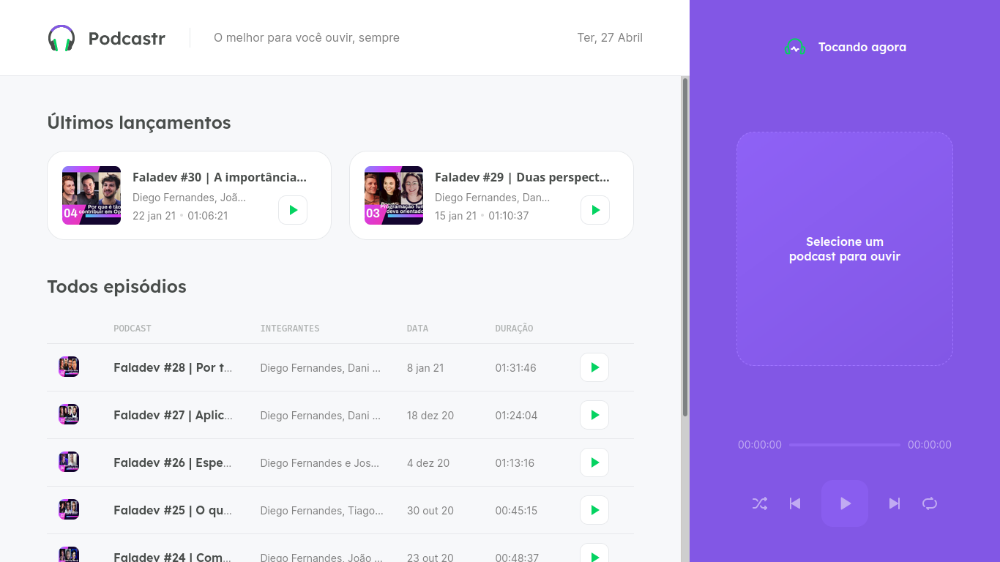
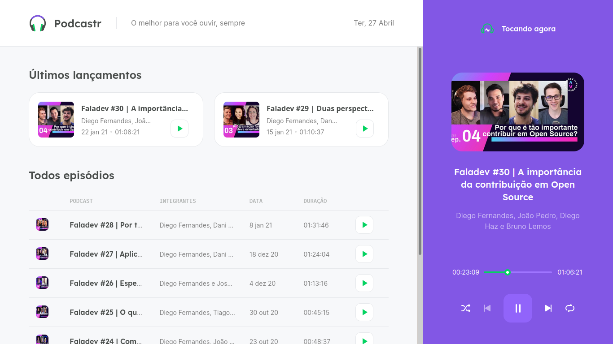
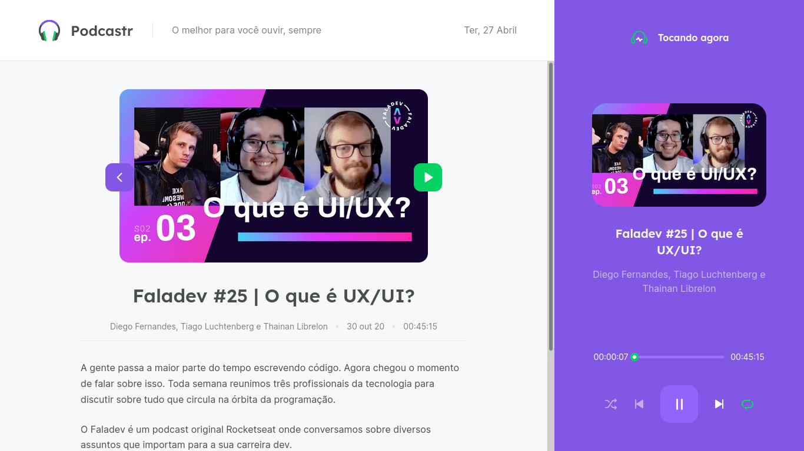

<h1 align="center"></h1>
  
<p align="center">Podcastr é um projeto em Next.js que foi desenvolvido durante a NLW #5 🚀</p>

<p align="center">

  <a href="https://rocketseat.com.br/" target="_blank">
    
  </a>

  <a href="https://github.com/rafaeldiehl" target="_blank">
    
  </a>

  

  
  
</p>

<h3 align="center"></h3>

### Tabela de Contéudos

<!--ts-->

- [Sobre](#sobre)
- [Layout](#layout)
- [Como usar](#como-usar)
  - [Pré-requisitos](#pre-requisitos)
  - [Instalando localmente](#instalacao)
  - [Funcionamento](#funcionamento)
- [Tecnologias](#tecnologias)
- [Features](#features)
<!--te-->

<hr />
<div id="sobre">
  <h2 align="center">📘 Sobre</h2>

  <p>Podcastr é uma aplicação web usada para ouvir podcasts. Foi desenvolvida durante o Next Level Week #5, um evento com duração de uma semana para programadores, promovido pela <a href="https://rocketseat.com.br">Rocketseat</a>.
</div>

<div id="layout">
  <h2 align="center">🖼️ Layout</h2>
  
  <p align="center">
    
    
    
  </p>

</div>

<div id="como-usar">
  
  <h2 align="center">🔎 Como usar</h2>
  
 <div id="pre-requisitos">
  <h3>Pré-requisitos</h3>

Para conseguir acessar o projeto localmente, certifique-se de ter as seguintes ferramentas instaladas em sua máquina:

- Node.js (obrigatório)
- Git (opcional)
- Yarn (opcional)

Além disto é bom ter um editor para trabalhar com o código, como o <a href="https://code.visualstudio.com">VSCode</a>.

 </div>

<div id="instalacao">
  <h3>Instalando localmente</h3>

Primeiramente, clone o repositório usando git ou baixe-o como zip:

```bash
git clone https://github.com/rafaeldiehl/podcastr.git
```

Em seguida, acesse a pasta raiz do projeto:

```bash
cd podcastr
## Caso tenha baixado como zip e já tenha descompactado
cd podcastr-main
```

Dentro da pasta raiz, instale as dependências:

```bash
npm install
## Caso esteja usando yarn
yarn install
```

Com as dependências já instaladas, inicie o cliente:

```bash
npm run dev
## Caso esteja usando yarn
yarn dev
```

Em seguida, inicie o servidor:

```bash
npm run server
## Caso esteja usando yarn
yarn run server
```

 </div>
 
 <div id="funcionamentor">
  <h3>Funcionamento</h3>

Você pode iniciar um podcast apertando o botão "Iniciar" com o ícone de seta verde para direita. É possível utilizar funções de controle do podcast na aba do Player, como ir para o próximo podcast, voltar para o anterior, entrar em looping e dispor os podcasts aleatoriamente.

 </div>

<div>

<div id="tecnologias">

  <h2 align="center">🛠 Tecnologias</h2>

As seguintes tecnologias foram usadas na construção do projeto:

- JavaScript
- TypeScript
- JSON
- Node.js
- React.js
- Next.js
- Sass

</div>

<div id="features">

  <h2 align="center">📌 Features</h2>

Além do projeto criado com as aulas, estão/serão implementadas as seguintes features.

- [ ] Responsividade
- [ ] Modo escuro
- [ ] Drag-and-drop
- [ ] PWA

</div>

<div id="license">

<h2 align="center">📝 Licença</h2>

Este projeto possui licença MIT. Veja <a href="https://github.com/rafaeldiehl/podcastr/blob/main/LICENSE.md">LICENSE.md</a> para mais detalhes.

<hr />

<p align="center">
  Feito com 💙 por <a href="https://github.com/rafaeldiehl">Rafael Diehl</a>
</p>
